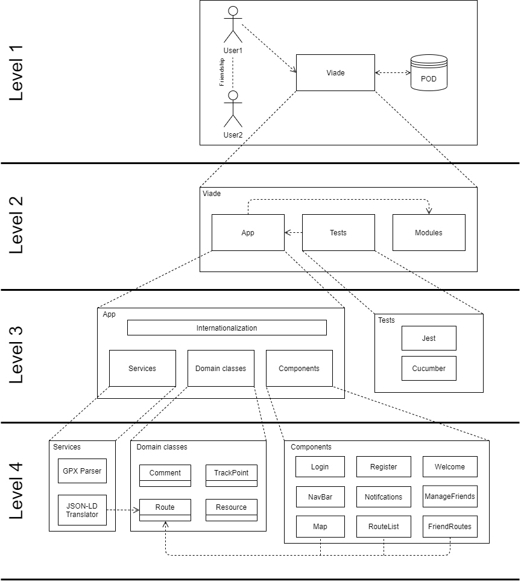

[[section-building-block-view]]

== Building Block View

=== Overall System Diagram
This diagrams stands as the whole structure of our system.

=== Whitebox Overall  (Level 1)

===== Motivation
The general structure of the system is an application, where users can see routes that are stored in their PODs, or in their friends PODs. Since the POD structure is already implemented we consider it as a neighbor system in this diagram.

===== Contained Building Blocks

[cols="1,2" options="header"]
|===
| **Name** | **Responsibility**
| Viade | The application that the user can see
| POD | The infrastructure for data that the user needs for using the application
|===

=== Level 2

===== Motivation
This level provides an overview of the types of code in the project.

===== Contained Building Blocks

[cols="1,2" options="header"]
|===
| **Name** | **Responsibility**
| App | Code oriented to solve the functionality of the viade project
| Tests | Code oriented to test the code un module App
| Modules | Stands for the npm modules installed in the project and our dependencies to them.
|===

=== Level 3

==== App

===== Motivation
During the design of the functionality implementation we were in need of structuring the code. In the degree we became used to use the layer architectural pattern, which does not really fit with the constraint of using REACT. Even though, we structured it in a similar way to the one in the pattern.

===== Contained Building Blocks

[cols="1,2" options="header"]
|===
| **Name** | **Responsibility**
| Internationalization | This stands for the cross cutting code that leads to an easy translation process of the app
| Domain classes | Here we have some Entities commonly used in the management of Routes, for instance a TrackPoint
| Services | Here we have complex functionality that does not really fit into a component
| Components | Based on the REACT framework, here we have presentation layer, and some logic
|===

==== Tests

===== Motivation
The code needs to be tested, in multiple ways if possible, so we need several test frameworks.

===== Contained Building Blocks

[cols="1,2" options="header"]
|===
| **Name** | **Responsibility**
| Jest | Test for functionality of the app
| Cucumber | Test for functionality of the app
|===

=== Level 4

==== Services

===== Motivation
There is some complex functionality and algorithms that may be need to be changed in the future, or even during the development sprints, such as the translations to the data in the pod. In this particular case, we depend on something that is not really fixed, which is the standard in viadeSpec.

In the end, we believe that this functionality should be separated from the rest, in order to improve extensibility and maintainability. 

===== Contained Building Blocks

[cols="1,2" options="header"]
|===
| **Name** | **Responsibility**
| GPX Parser | Translates a gpx structure to domain classes objects that we can handle.
| JSON-LD Translator | Translates domain objects to jsonld format and viceversa.
|===

==== Domain Classes

===== Motivation
Some entities are needed during the develpment of the project. Routes, comments, images, videos... To manage them properly we have created classes that model these entities 

===== Contained Building Blocks

[cols="1,2" options="header"]
|===
| **Name** | **Responsibility**
| Route | Models a route, not only the geolocalization coodinates, but also, its comments and resources
| TrackPoint | Models a combination of coordinates, latitude, longitude...
| Comment | Models a user comment
| Resource | Models an image or a video
|===

==== Components

===== Motivation
By means of React we have created several components to cover the expected functionality of the app.

===== Contained Building Blocks

[cols="1,2" options="header"]
|===
| **Name** | **Responsibility**
| Login | Allows the user to login in the app, by means of a login to their POD
| Register | Allows new Users to register and get a POD
| Welcome | This is the first component that can be seen when logged into the app
| NavBar | Allows the navigation across the different components of the app
| Notifications | Handles the notification events
| ManageFriends | Handles friends, and allows to see information related to them
| Map | Displays the route and information about it to the User
| RouteList | Displays all the routes of the User
| FriendRoutes | Displays the routes of a User's friend
|===
